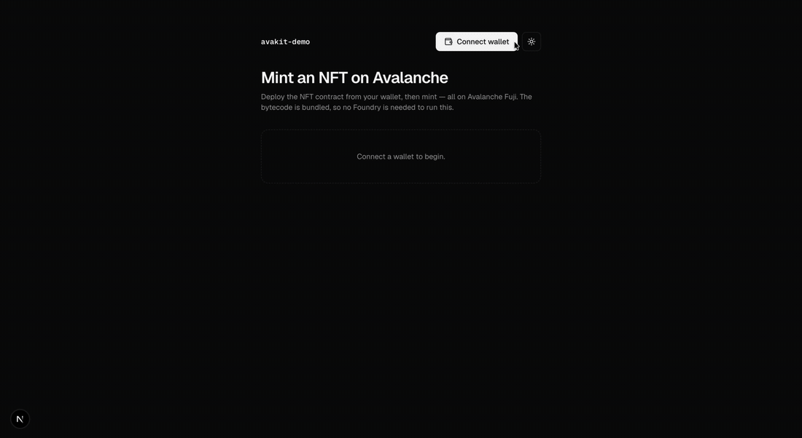

# AvaKit 🔺

> The open-source, AI-native developer toolkit for Avalanche.

[](https://www.npmjs.com/package/create-avalanche-app)
[](https://www.npmjs.com/package/@avakit/core)
[](https://www.npmjs.com/package/@avakit/react)
[](./LICENSE)
[](https://testnet.snowtrace.io/tx/0x9a1f139577964587ac03123d719f25c0b68024a4c8eab0dc258ad9c925a8e090)

Scaffold a social-login dapp, deploy-ready, with agent context baked in. One core, four surfaces — **no seed phrases, no boilerplate.**

**[avakit.vercel.app](https://avakit.vercel.app)** · **[Documentation](https://avakit.vercel.app/docs)** · **[Templates](https://avakit.vercel.app/templates)**

```bash
npm create avalanche-app@latest
```

That's it — connect with a social login, read your balance, and send your first transaction on Avalanche in minutes.


**Then deploy an NFT contract and mint it — straight from the browser, on Fuji:**



> **Proven live on Fuji.** The mint in that clip is a real on-chain transaction — [view it on Snowtrace](https://testnet.snowtrace.io/tx/0x9a1f139577964587ac03123d719f25c0b68024a4c8eab0dc258ad9c925a8e090) (contract [`0x7612…7786`](https://testnet.snowtrace.io/address/0x7612e031216250384ebdb151553a0c5b89b87786)). No Foundry, no backend — the bytecode is bundled and deployed from the user's wallet.

---

## Why AvaKit

Avalanche's C-Chain is EVM-compatible and end-user onboarding is already solved (Core wallet's seedless social login). The remaining friction is on the **developer** side: spinning up a modern dapp with onboarding wired up still takes hours. AvaKit removes that.

- **Social-login onboarding** — users sign in with Google; no seed phrases. Keys stay in the provider's HSM; AvaKit never touches them.
- **AI-native by default** — every generated app ships `CLAUDE.md`, `llms.txt`, and `.cursor/rules`, and `@avakit/mcp` lets Claude Code / Cursor scaffold, deploy, and read chain state for you.
- **shadcn/ui, themed** — a clean design system with dark/light from day one. Copy-in components, no vendor lock-in.
- **Deploy-ready** — contracts compile to bundled bytecode, so you can deploy straight from the browser. Fuji testnet by default.
- **Safe defaults** — testnet-first, mainnet is explicit opt-in, secrets stay in env.
- **Wrap, don't rewrite** — built on viem, Web3Auth, and Foundry, packaged for a great DX.

## Packages

| Package | What it is |
| --- | --- |
| [`@avakit/core`](https://www.npmjs.com/package/@avakit/core) | Framework-agnostic kernel — viem clients, wallet adapters, deploy helpers, chain data |
| [`@avakit/react`](https://www.npmjs.com/package/@avakit/react) | `<ConnectAvalanche>` social-login widget, `<TransactionButton>`, and hooks — built on shadcn/ui |
| [`create-avalanche-app`](https://www.npmjs.com/package/create-avalanche-app) | Batteries-included scaffolder |
| [`@avakit/mcp`](https://www.npmjs.com/package/@avakit/mcp) | MCP server — scaffold, deploy, and read Avalanche from Claude Code / Cursor |

## Templates

```bash
npm create avalanche-app@latest my-app -- --template nft-mint
```

| Template | What you get |
| --- | --- |
| `minimal` | Social-login wallet, balance, and a first transaction |
| `nft-mint` | Deploy an ERC-721 from the browser, then mint |
| `token-gated-app` | Unlock content for holders of an access-pass NFT |
| `erc20-token` | Deploy an ERC-20, mint supply, and transfer |

Every template ships with a social-login wallet, shadcn/ui (black & white, dark/light), and AI context files.

## Use it in an existing app

```bash
npm install @avakit/react @avakit/core viem
```

```tsx
"use client";
import { injectedAdapter } from "@avakit/core";
import { fuji } from "@avakit/core/chains";
import { AvaKitProvider, ConnectAvalanche } from "@avakit/react";

export function App() {
  return (
    <AvaKitProvider chains={[fuji]} adapters={[injectedAdapter()]}>
      <ConnectAvalanche />
    </AvaKitProvider>
  );
}
```

Add social login by installing `@web3auth/modal` and passing `web3authAdapter({ clientId })` (from `@avakit/core/web3auth`).

## Build with an AI agent

Add the MCP server to Claude Code, Cursor, or Claude Desktop:

```json
{
  "mcpServers": {
    "avakit": { "command": "npx", "args": ["-y", "@avakit/mcp"] }
  }
}
```

Then just ask: *"Scaffold an nft-mint dapp and deploy it to Fuji."*

## Repository layout

```
packages/
  core/                 @avakit/core
  react/                @avakit/react
  mcp/                  @avakit/mcp
  create-avalanche-app/ scaffolder + templates
apps/web/               the avakit.vercel.app site
examples/hello-avax/    live wallet demo
docs/                   planning, PRD, architecture, ADRs, specs
```

## Contributing

```bash
pnpm install
pnpm build       # all packages (Turborepo)
pnpm test        # Vitest
pnpm lint        # Biome
pnpm typecheck   # TypeScript
```

Requirements: Node ≥ 20.11, pnpm ≥ 10. See [`CONTRIBUTING.md`](./CONTRIBUTING.md) and the design docs in [`docs/`](./docs). Conventions: English everywhere, shadcn/ui only, Framer Motion / GSAP for animation, latest stable versions.

## License

[MIT](./LICENSE) © AvaKit contributors

---

<sub>Built on [viem](https://viem.sh), [Web3Auth](https://web3auth.io), [Foundry](https://getfoundry.sh), and [shadcn/ui](https://ui.shadcn.com). Testnet-first (Fuji); mainnet is opt-in.</sub>
